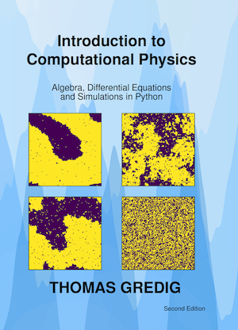

# PHYS 360 - Computational Physics

Accompanying **worksheets** for [Introduction to Computational Physics](https://www.amazon.com/Introduction-Computational-Physics-Differential-Simulations/dp/B0FL7W88TM), second edition, by Thomas Gredig (ISBN: 979-8346096047).

